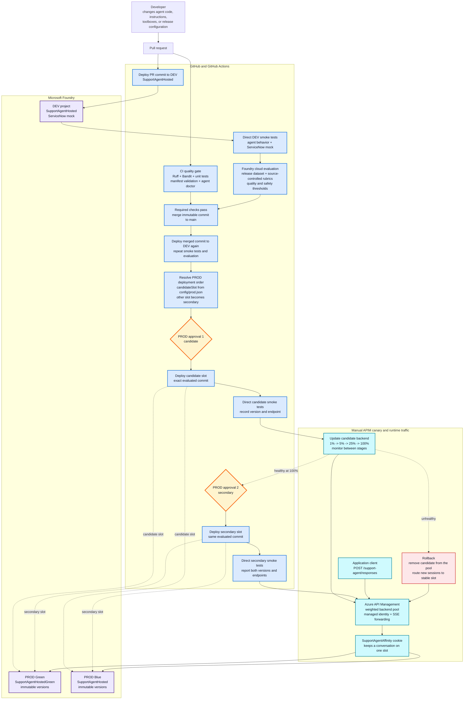

# SupportAgent CI/CD lifecycle

This repository contains a Microsoft Foundry hosted agent and the pipeline that validates, evaluates, and promotes it.

## Deployment flow

### Demo narrative

1. A pull request starts two required paths: conventional CI checks and a real
   deployment of the exact commit to the isolated DEV Foundry project.
2. DEV is invoked directly for smoke tests, then Foundry evaluates it against
   the release dataset, built-in evaluators, custom rubrics, and repository
   thresholds.
3. Only a commit that passes both paths can merge. The merged commit is deployed
   and evaluated in DEV again so production never promotes untested source.
4. `candidateSlot` selects which permanent PROD slot is updated first; the
   workflow automatically identifies the other slot as secondary.
5. The first protected-environment approval deploys the candidate and records
   its immutable Foundry version and direct Responses endpoint.
6. APIM routing is changed manually for new sessions while the affinity cookie
   keeps each existing conversation on one slot. Traffic can progress from a
   small canary to 100% while operators watch technical and quality signals.
7. If the canary is healthy, the second approval deploys the identical commit to
   the secondary slot. Both APIM backends then represent the same reviewed
   release.
8. Rollback changes APIM routing only. Requests are never retried across slots
   because agent tool calls may have side effects.

## Agent

`azure.yaml` defines separate DEV, Blue, and Green deployment services that all
deploy the shared `src/support-agent` source. DEV retains `SupportAgentHosted`;
PROD uses permanent Blue and Green agent slots defined in `config/prod.json`.

The agent uses:

- Microsoft Agent Framework
- The OpenAI Responses protocol
- Optional Foundry Toolbox definitions for ServiceNow and web-search tools
- Environment-specific Foundry projects and tool connections

The runtime is defined in `main.py`. Behaviour and safety boundaries are defined
in `instructions.py`. The unavailable ServiceNow MCP integration is currently
disabled in DEV and both PROD slots through `SERVICENOW_MODE=mock`. Mock mode
does not initialize the Foundry Toolbox, access ServiceNow, or fabricate tool
results. The PROD toolbox and connection configuration remain source-controlled
so live mode can be restored after the downstream MCP host is healthy.

## Source of truth

| Concern | Files |
|---|---|
| Hosted deployment | `azure.yaml`, `src/support-agent/agent.yaml` |
| Runtime | `src/support-agent/main.py`, `requirements.txt`, `Dockerfile` |
| Behaviour | `src/support-agent/instructions.py` |
| Tools | `src/support-agent/toolbox.dev.yaml`, `toolbox.prod.yaml` |
| Environment configuration | `config/dev.json`, `config/prod.json` |
| Release cases | `evals/release.json` |
| Release thresholds | `evals/thresholds.json` |
| Evaluator rubrics | `src/support-agent/evaluators` |
| CI/CD policy | `.github/workflows/ci.yml`, `.github/workflows/cd.yml` |

A source commit represents one complete agent candidate. DEV and PROD use different identities, endpoints, and tool connections, but they deploy the same reviewed source.

## Pull-request flow

Every pull request starts two checks.

The CI workflow:

1. Runs Ruff linting.
2. Runs a Bandit security scan.
3. Runs unit and manifest tests.
4. Validates the evaluation data.
5. Runs the local hosted-agent configuration doctor.

The deployment workflow:

1. Authenticates to Azure through GitHub OIDC.
2. Deploys the pull-request commit to the DEV Foundry project.
3. Verifies the hosted-agent status.
4. Runs agent and ServiceNow smoke tests.
5. Uploads a versioned release dataset and source-controlled rubrics to Foundry.
6. Runs a Foundry cloud evaluation against the exact deployed agent version.
7. Enforces the repository release thresholds against the cloud results.

The DEV deployment and evaluation job is a required merge check.

## Evaluation

`scripts/run_eval_gate.py` owns the evaluation sequence:

1. `cloud` converts `evals/release.json` to JSONL and uploads a versioned Foundry dataset.
2. `cloud` creates Foundry rubric-evaluator versions from the source-controlled `support_quality` and `joke_instruction` definitions.
3. `cloud` creates a project-managed evaluation using fluency, task-adherence, violence, and both custom rubrics.
4. Foundry invokes the exact deployed hosted-agent version and stores aggregate and row-level results in the project.
5. `enforce` compares the cloud results with `evals/thresholds.json`.

The GitHub summary links to the Foundry Portal report and includes each test request, the agent response, custom evaluator results, scores, and reasons. The complete normalized JSON report is also uploaded as a workflow artifact.

## Production promotion

After a pull request is merged, the merged commit is deployed and evaluated in DEV again.

If it passes:

1. The workflow resolves the candidate slot selected by
   `config/prod.json`.
2. The candidate job waits for the first approval on the protected `prod`
   GitHub Environment.
3. The same evaluated commit is deployed to the candidate slot and directly
   verified by the PROD agent and ServiceNow mock smoke tests.
4. The secondary job waits for a second `prod` approval.
5. The same commit is deployed to the other slot and receives the same direct
   smoke tests.
6. The workflow summary reports both immutable versions and Responses endpoints
   for the manual APIM rollout.

There is no intermediate test environment. Promotion is DEV to two sequential,
independently approved PROD deployments.

## Manual APIM canary rollout

APIM is intentionally managed outside this repository. Configure two permanent
APIM backends, one for each PROD slot:

| Slot | Foundry agent |
|---|---|
| Blue | `config/prod.json` → `slots.blue.agentName` |
| Green | `config/prod.json` → `slots.green.agentName` |

Configure the APIM backend pool with weighted routing and cookie-based session
affinity. The client must retain the affinity cookie for the complete Responses
conversation so subsequent requests do not move between agent slots.

Use APIM managed identity for calls to Foundry:

1. Assign the APIM identity the **Foundry Agent Consumer** role on the PROD
   Foundry project or on both agents.
2. Configure backend authentication with the managed-identity resource
   `https://ai.azure.com`.
3. Forward Responses traffic without response buffering.
4. Do not retry failed agent `POST` requests across slots because tool calls can
   have side effects.

For a release:

1. Set `candidateSlot` in `config/prod.json` to the slot that is not currently
   serving production traffic.
2. Merge the reviewed change. The CD workflow deploys and directly tests that
   candidate after the first PROD approval without changing APIM.
3. Update that slot's APIM backend URL from the workflow summary if the URL has
   changed.
4. Add the candidate to the APIM pool at a low weight, such as 1 or 5, while
   retaining session affinity.
5. Increase the candidate weight after each monitoring gate.
6. At 100%, approve the secondary PROD job. It deploys and tests the same commit
   on the other slot.
7. Update the secondary APIM backend URL from the final workflow summary. Both
   backends now run the same reviewed release.
8. Change `candidateSlot` before the next release so the inactive or
   lower-weight slot is deployed first.

Rollback is an APIM-only operation: remove the candidate from the pool and
route new sessions to the previous slot. Keep the rejected Foundry version
available until its traces and evaluation evidence have been retained.
